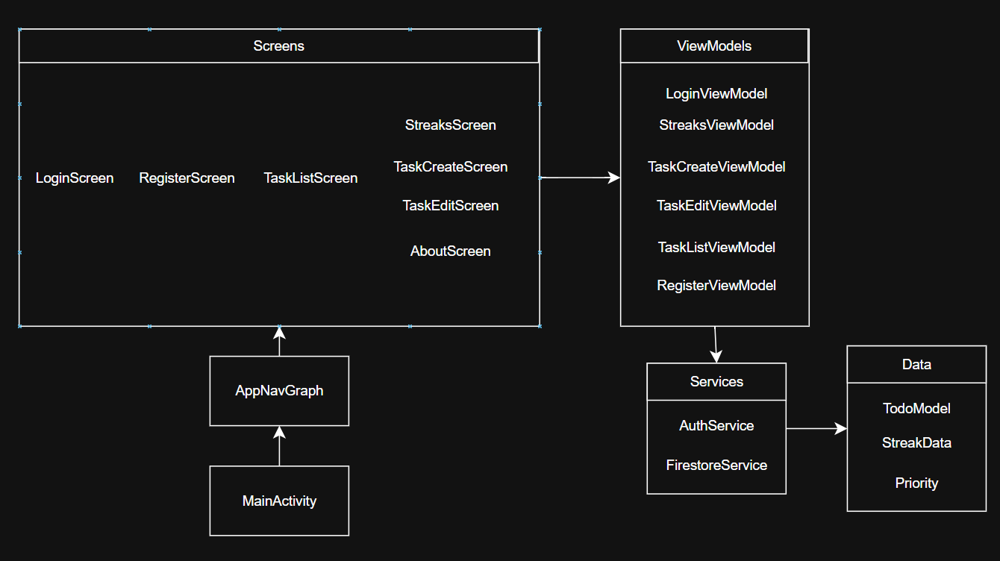

# ToDoMore App 

Mobile App Development 2 - CA2

## Functionality & Tools
ToDoMore is a task management that has the following functionality:

- Register/Login with Firebase Authentication (Email and Google).
- Create, edit, view, and delete tasks with specific priority levels.
- Toggleable Focus Mode to filter and display tasks that are high priority.
- Mark tasks as complete and delete them using clear completed (Single or Group delete).
- Track daily streak data such as total tasks completed, longest streak, current streak, and the last task completed date. 

**Core Tools and APIs Used:**
- Firebase Authentication.
- Firebase Firestore.
- Google Credential Manager (The one tap sign-in).
- Hilt (Injections)

## UML & Class Diagram

> **Note:** This diagram was made using Draw.io.

- **Screens**:
  - Login, Register, TaskList, Create, Edit, Streaks, About. 
- **ViewModels**:
  - One per screen (e.g: LoginViewModel, TaskListViewModel).
- **Data**:
  - TodoModel, StreakData, Priority level.
- **Services**:
  - AuthService, FirestoreService (Injected via Hilt).
- **NavGraph**:
  - Handles the routing between all screens. 

## UX / DX Approach Adopted
- ToDoMore's UI was built primarily using Jetpack Compose.
- Consistent use of Material 3 components.
- MVVM architecture applied across the app using Hilt.

## Git Approach
- Git used consistently with meaningful and stable commits throughout.
- Each commit was verified to be in a working state before pushing.

## Personal Statement
ToDoMore was a valuable but challenging project to develop. It pushed me to apply everything I have learnt throughout this module, especially when working with Firebase integration.
One challenge that arose during development was implementing Firebase database Firestore, which delayed progress at times. However, I was able to overcome and fix the issues through testing and analysis.

Implementing custom features like my streak system and Focus mode helped me better grasp a better understanding of connecting up backend logic and user experience. I also gained hands-on experience using MVVM architecture, injection with Hilt, and Jetpack Compose for building modern UIs.

Overall, this project helped reinforced the covered material in the labs by giving me an opportunity to apply the learning outcomes from them into my own application.

### References/Resources used:

#### CA1
- <https://stackoverflow.com/questions/69591707/how-to-strikethrough-text-in-android-jetpack-compose>
- <https://stackoverflow.com/questions/76792269/combinedclickable-for-button-android-compose>
- <https://www.baeldung.com/kotlin/json-convert-data-class>
- <https://stackoverflow.com/questions/58743541/how-to-get-context-in-jetpack-compose>
- <https://blog.zachklipp.com/remember-mutablestateof-a-cheat-sheet/>

#### CA2
- <https://saurabhjadhavblogs.com/jetpack-compose-bottom-navigation-nested-navigation-solved>
- <https://firebase.google.com/docs/firestore/manage-data/transactions#transactions>
- <https://stackoverflow.com/questions/68459694/runtransaction-in-firestore>
- <https://firebase.google.com/docs/firestore/manage-data/add-data#set_a_document>
- <https://docs.oracle.com/javase/8/docs/api/java/time/LocalDate.html>
- <https://stackoverflow.com/questions/59747184/kotlin-set-aplha-for-views-programmatically#59747284>